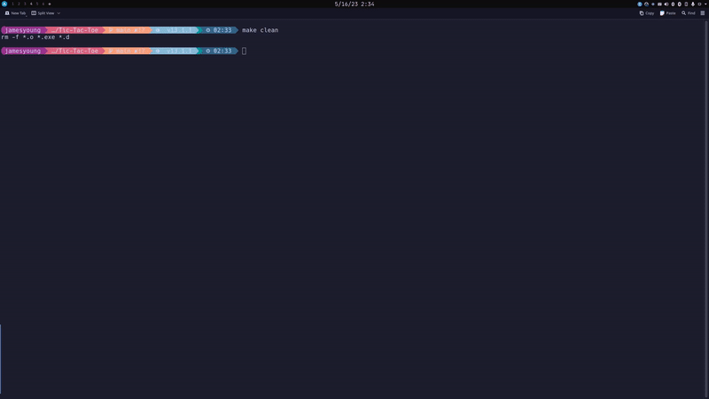

# Tic-Tac-Toe with Minimax Algorithm
A 3x3 Tic-Tac-Toe game written in C++ with AI that plays the best move found with the [minimax alogrithm](https://en.wikipedia.org/wiki/Minimax).

## Demo
Example of playing against computer as X.

<!--  -->


## Quick Usage
Only tested with Linux, but should work on other systems as long as system has C++ compiler.

1. Clone this repository (or just copy the relevant file contents).
``` 
git clone https://github.com/jamesyoung-15/Tic-Tac-Toe-Minimax
 ```
 2. (Optional) Compile the program with make.
 ```
make
 ```
 3. Run the script
 ```
 ./tic-tac-toe-game.o
 ``` 


## Minimax Algorithm

Diagram of how it works:


Pseudocode:
```
function minimax(node, depth, maximizingPlayer) is
    if depth = 0 or node is a terminal node then
        return the heuristic value of node
    if maximizingPlayer then
        value := −∞
        for each child of node do
            value := max(value, minimax(child, depth − 1, FALSE))
        return value
    else (* minimizing player *)
        value := +∞
        for each child of node do
            value := min(value, minimax(child, depth − 1, TRUE))
        return value
```

Implementation (in [ai.cpp](./ai.cpp)):
``` C++
BoardOptimalMove BoardTree::getOptimalMove(const unsigned int depth)
{
    // If tree is empty, returns an illegal move
    if (isEmpty()) 
    {
        return BoardOptimalMove();
    }

    // return score and random coordinate if game won, game finished with no winner, or 0 depth passed
    if(depth==0 || root->board.checkWin() || root->board.boardFull())
        return BoardOptimalMove(root->board.getBoardScore(),BoardCoordinates(1,1));

    // Else, we find the estimated score and optimal move of this node by calculating the score of each children node
    // Player X is trying to maximize the score, so the estimated score is the maximum of children scores
    // Vice versa, player O is trying to minimize the score
    int estimatedScore=0;
    if(root->board.getCurrentPlayer()==X)
        estimatedScore=-WIN_SCORE-1000;
    else if(root->board.getCurrentPlayer()==O)
        estimatedScore=WIN_SCORE+1000;
    BoardOptimalMove bestMove;


   // otherwise do as usual
        // for each subtree, build tree if empty, if move illegal subtree move to next subtree
    for(int i=0;i<BOARD_SIZE;i++)
    {
        for(int j=0;j<BOARD_SIZE;j++)
        {
            BoardCoordinates coords = BoardCoordinates(i,j);;
            // build the subtree if it is empty
            if(root->subTree[i][j].isEmpty())
            {
                getSubTree(coords);
            }
            BoardOptimalMove childMove = root->subTree[i][j].getOptimalMove(depth-1);
            if (childMove.score == ILLEGAL) 
            {
                // If the move is illegal, the subtree corresponds to an invalid move/board, simply skip to the next subtree
                continue;
            }
            if((root->board.getCurrentPlayer()==X && childMove.score>estimatedScore) || (root->board.getCurrentPlayer()==O && childMove.score<estimatedScore))
            {
                estimatedScore = childMove.score;
                bestMove = BoardOptimalMove(estimatedScore,coords);
            }

        }
    }

    return bestMove;
}

```